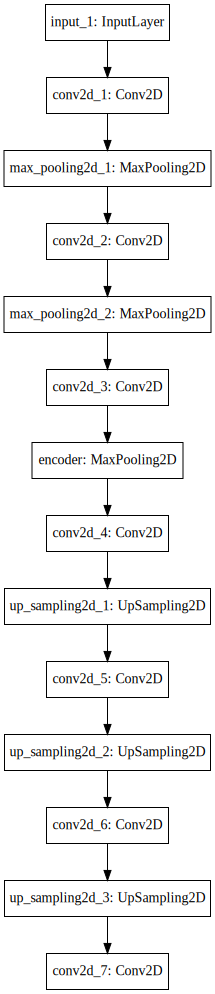
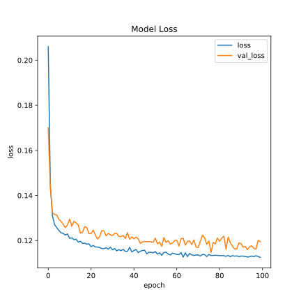

# LT2316 H18 Assignment 2

Git project for implementing assignment 2 in [Asad Sayeed's](https://asayeed.github.io) machine learning class in the University of Gothenburg's Masters
of Language Technology programme.

## Your notes

I chose to do Option A.

## How to run

I tried to keep track of dependencies with pipenv, but that did not really work on the server.  
Instead I would like you to use the requirements.txt to install those requirements.  
Please use `python3.6`.

- `pip3 install -r requirements.txt`
- `python3.6 train.py -P A /scratch/gusstefl/model.h5 bear toothbrush scissors`
- `python3.6 test.py -P A models/model_vanilla.h5 bear toothbrush scissors`

## Part 1 Option A  - Convolutional image autoencoder

This is the model I would like to present:

It is built out of 3 convolutional steps that are each followed by a max pooling layer.
They compress the original 200x200x3 image into a 10x10x8 representation.
Afterwards convolutional layers, combined with upsampling try to restore the image.

This is a list of the detailed parameters:

|Layer (type)                   |Output Shape         |Param # |
|-------------------------------|---------------------|--------|
|input_1 (InputLayer)           |(None, 200, 200, 3)  |0       |
|conv2d_1 (Conv2D)              |(None, 200, 200, 16) |448     |
|max_pooling2d_1 (MaxPooling2D) |(None, 40, 40, 16)   |0       |
|conv2d_2 (Conv2D)              |(None, 40, 40, 8)    |1160    |
|max_pooling2d_2 (MaxPooling2D) |(None, 20, 20, 8)    |0       |
|conv2d_3 (Conv2D)              |(None, 20, 20, 8)    |584     |
|encoder (MaxPooling2D)         |(None, 10, 10, 8)    |0       |
|conv2d_4 (Conv2D)              |(None, 10, 10, 8)    |584     |
|up_sampling2d_1 (UpSampling2D) |(None, 20, 20, 8)    |0       |
|conv2d_5 (Conv2D)              |(None, 20, 20, 8)    |584     |
|up_sampling2d_2 (UpSampling2D) |(None, 40, 40, 8)    |0       |
|conv2d_6 (Conv2D)              |(None, 40, 40, 16)   |1168    |
|up_sampling2d_3 (UpSampling2D) |(None, 200, 200, 16) |0       |
|conv2d_7 (Conv2D)              |(None, 200, 200, 3)  |435     |
Total params: 4,963

### Hyperparameter

To find an appropriate batch size I timed the time per epoch for a few different values.
You can see the results in the following table:

| Batch Size | Time per epoch |
|------------|----------------|
| 8          | 25s            |
| 16         | 25s            |
| 32         | 23s            |
| 64         | 24s            |
| 128        | 25s            |

As you can see, the time per epoch did not vary much. I chose the a size of 32 due to the relatively low time per epoch.

To find an appropriate number of epochs I left the model running for 100 epochs and had a look at the loss function over time:

The value loss is computed based on an independent set of images.

The loss value seems to improve slower as the epochs approach 100, especially the validation loss does not seem to progress much. That is why I decided to stop training here.

For the loss function I went with `mean_absolute_error`. My reasoning is that I wanted to use something that works well on continuous data of images, so I excluded all categorical losses. I chose to not use the squared variant since it focuses on outliers.

### Architectural variant

To create an architectural variant, I created a much simpler convolutional autoencoder. It consists of fewer layers, but has the same middle layer size as the bigger network. It's model looks like this:

In addition to the previously used Convolutional and MaxPooling layers, I have started adding Dropout layers after the pooling layers. These are used for my hyperparameter variant, which sets the dropout rate to either `0` or `0.5`.

This produces four variants and loss functions:
- Large  
  
- Small  
  
- Large with Dropout  
  
- Small with Dropout  
  

### Reflection

The bigger model is able to fit the training data most accurately. The smaller model does not quite reach the same level. Judging by the value loss the more complex model does not even overfit more than the small model. It might be worth exploring much larger networks.

Introducing a dropout rate of `0.5` is very efficient at prioritizing generalization over fitting the training data. Even though it does not reach the same precision using the high dropout rate, it does achieve a lower loss level on the validation set than on the training data. This surprised me, but is probably due to the validation set being easier to learn in some way.

### Why is it bad to validate/test on the training data?

Neural networks can easily overfit training data. Validating or testing such a model with the data it has been trained on tells us nothing about its generalization power.  
Doing training and validation effectively tests how well the model can remember data.

### Model files

You can find the model files and plots of their architecture in the models folder. These can be passed to the test script.

### Clustering

I ran PCA on the outputs of each models' encoding layers. The results are the following 2D scatter plots. Each color represents the category denoted in the legend:

- Large  
  
- Small  
  
- Large with Dropout  
  
- Small with Dropout  
  

I find it difficult to see any patterns in these plots.
Therefor the autoencoder does not strongly cluster values based on their categories, or those clusters are lost in the PCA step.
